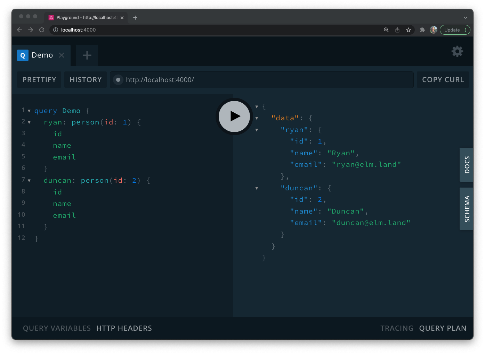

# @ryannhg/elm-graphql-server
> Create a GraphQL API with Elm!



## Playing around locally

_You'll need [Node.js](https://nodejs.org) to run this project on your local computer._

```bash
npm start
```

- Visit http://localhost:4000 to use the GraphQL API
- Mess with Elm files in `src/Resolvers` to change how the API responds

## Overview

The server starts in a file called `src/index.js`. It is powered by an Elm program, compiled
as a `Platform.worker`. That means you'll need to compile your Elm app first with `npm run elm:build`, or you can use the `npm run dev` script that automatically compiles things as you code!

Right now, the API server doesn't do too much. It listens for GraphQL requests at `http://localhost:4000`, and sends that request information to our Elm worker, so we can handle our resolvers with Elm code.

For now, you can modify the GraphQL schema by editing `src/schema.gql`, and add a new resolver in `src/Worker.elm`.

I have been making modules in `src/Resolvers` to organize the code, but that's just so you can easily follow what's going on!

This is not a production-ready thing, but I thought it would be a fun experiment to see what using the Elm language would be like for a backend GraphQL API.

A real implementation would require a nice way to talk to a database, a third-party HTTP service, or do things like application logging– but for now this is all we have 🙂

### Talking to a SQL Database

I've been exploring communicating to a `sqlite` database. This project supports basic forms of:

- [x] `SELECT` statements
  - Example of `findOne` with the [`user` query](./src/Resolvers/Query/User.elm)
  - Example of `findAll` with the [`users` query](./src/Resolvers/Query/Users.elm)
- [x] `INSERT` statements
  - Example of `insertOne` with the [`createUser` mutation](./src/Resolvers/Mutation/CreateUser.elm)
- [x] `UPDATE` statements
  - Example of `updateOne` with the [`updateUser` mutation](./src/Resolvers/Mutation/UpdateUser.elm)
- [x] `DELETE` statements
  - Example of `deleteOne` with the [`deleteUser` mutation](./src/Resolvers/Mutation/DeleteUser.elm)

### Solving the N + 1 problem

This repo also features examples of queries that need to access data across multiple tables. For example, if a user creates a post, the database looks something like this:

#### `users`

id | username | avatarUrl
--- | --- | ---
1 | "ryan" | NULL

#### `posts`

id | caption | imageUrls
--- | --- | ---
3 | "Elm conf 2019 was sweet!" | [ ... ]


#### `user_authored_post`

id | postId | userId
--- | --- | ---
5 | 3 | 1

A user of our GraphQL API might write a query like this, to get the `id` and `username` of the author of post #3:

```graphql
query {
  post(id: 3) {
    id
    caption
    author {
      id
      username
    }
  }
}
```

When this GraphQL query comes through [the Query.post resolver](./src/Resolvers/Query/Post.elm) runs a few SQL statements:

```sql
-- Get the data stored for that post
SELECT id, caption FROM posts WHERE id = 3;
```

```sql
-- Check the "user_authored_post" table for any authors
SELECT userId FROM user_authored_post WHERE postId = 3;
```

```sql
-- The last query found a row with userId = 1,
-- so we pass that into the final SQL query that
-- fetches the `id` and `username` for our author
SELECT id, username FROM users WHERE id = 1;
```

If we need 3 SQL statements for one post and its author, how does this work when fetching multiple posts?

```graphql
query {
  posts {
    id
    caption
    author {
      id
      username
    }
  }
}
```

This GraphQL request will be sent to [our Query.posts resolver](./src/Resolvers/Query/Posts.elm), which lists the first 25 posts in the system. If we repeated the previous strategy for each of those posts– that would mean 3 * 25... 75 SQL queries!?

Luckily for us, all our resolvers can access [an `info` argument for the GraphQL query](https://graphql.org/learn/execution/#root-fields-resolvers). This allows us to ask the question: "Does this request need authors?"

If the answer is yes, we use SQL's `IN` keyword to fetch author information for all 25 posts using only 3 SQL statements! (This would still only need 3 queries if we brought back 10, 100, or 1000 posts):

```sql
-- First, we ask for the first 25 posts
SELECT id, caption FROM posts LIMIT 25;
```

```sql
-- Now that we have all those posts, we use their IDs 
-- to query the `user_authored_post` table:
SELECT postId, userId FROM user_authored_post WHERE postId IN ( 1, 2, 3, ... 25 );
```

```sql
-- Once we have all those edges, we can use the userId column
-- to do one final SQL query for the author data for all those author ids
SELECT id, username FROM users WHERE id IN ( 1, 2, 3, 4, ... );
```

Using this `WHERE id IN ...` strategy helps us avoid a common GraphQL pitfall called the [N + 1 problem](https://medium.com/the-marcy-lab-school/what-is-the-n-1-problem-in-graphql-dd4921cb3c1a). You can see this in action yourself by pulling this repo, spinning it up with NPM, and querying for some posts at http://localhost:4000!
